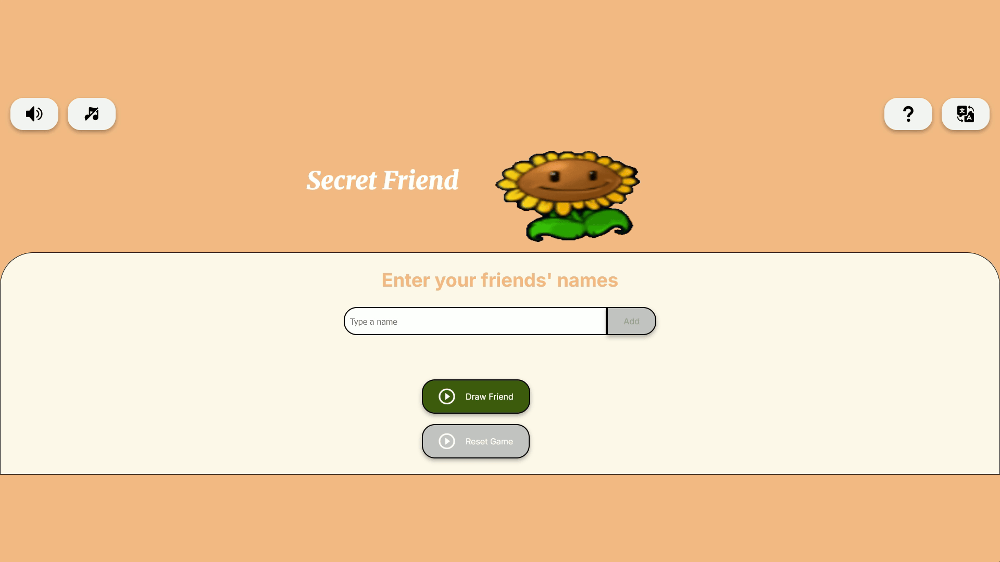

<div align="center">

  # 🎁 Secret Friend Game

  

  <br>

  [](https://acheron-o.github.io/Secret-Friend-Game/)
  [](https://challenge-secret-friend-pt.vercel.app/)
  

  <p align="center">
    A modern, interactive, and minimalist web application for organizing Secret Santa draws.
    <br />
    <a href="https://challenge-secret-friend-pt.vercel.app/"><strong>View Demo »</strong></a>
    <br />
    <br />
    <a href="https://github.com/Acheron-o/Secret-Friend-Game/issues">Report Bug</a>
    ·
    <a href="https://github.com/Acheron-o/Secret-Friend-Game/pulls">Request Feature</a>
  </p>
</div>

---

## 📋 Table of Contents
- [About the Project](#-about-the-project)
- [Key Features](#-key-features)
- [Technologies Used](#-technologies-used)
- [Getting Started](#-getting-started)
- [Author](#-author)

---

## 📖 About the Project

The **Secret Friend Game** is a web application designed to make drawing names for "Secret Santa" (Amigo Secreto) events quick, fair, and fun. 

The primary objective of this project was to strengthen skills in **Programming Logic** and **DOM Manipulation**, creating a polished user experience with animations, sound effects, and state management without relying on heavy frameworks.

---

## ✨ Key Features

* **🌍 Internationalization (i18n):** Full support for multiple languages (English, Portuguese, Spanish, French, German, Italian, Chinese, Japanese, and Indonesian).
* **🎨 Modern UI/UX:** A clean, "glassmorphism" inspired design with a pleasing color palette and smooth transitions.
* **🔊 Audio Feedback:** Interactive sound effects for adding names and drawing results (with mute option).
* **🛡️ Input Validation:** Prevents duplicate names, empty inputs, and drawing with insufficient participants.
* **📱 Fully Responsive:** Works perfectly on desktops, tablets, and mobile devices.
* **♻️ Dynamic SVG Icons:** High-quality rendered flag icons and UI elements.

---

## 🚀 Technologies Used

*  **HTML5**: Semantic structure.
*  **CSS3**: Custom properties, Flexbox, and animations.
*  **JavaScript (ES6+)**: Logic, DOM manipulation, and state management.

---

## ⚙️ Getting Started

To run this project locally, follow these simple steps:

1.  **Clone the repository:**
    ```bash
    git clone [https://github.com/Acheron-o/Secret-Friend-Game.git](https://github.com/Acheron-o/Secret-Friend-Game.git)
    ```

2.  **Navigate to the project directory:**
    ```bash
    cd Secret-Friend-Game
    ```

3.  **Run the application:**
    * **Method 1 (Recommended):** Use the **Live Server** extension in VS Code.
    * **Method 2:** Simply double-click the `index.html` file to open it in your default browser.

---

## 👨‍💻 Author

<div align="center">
  <a href="https://github.com/Acheron-o">
    <br>
    <sub><b>Caio</b></sub>
  </a>
</div>

<br>

Made by Caio.